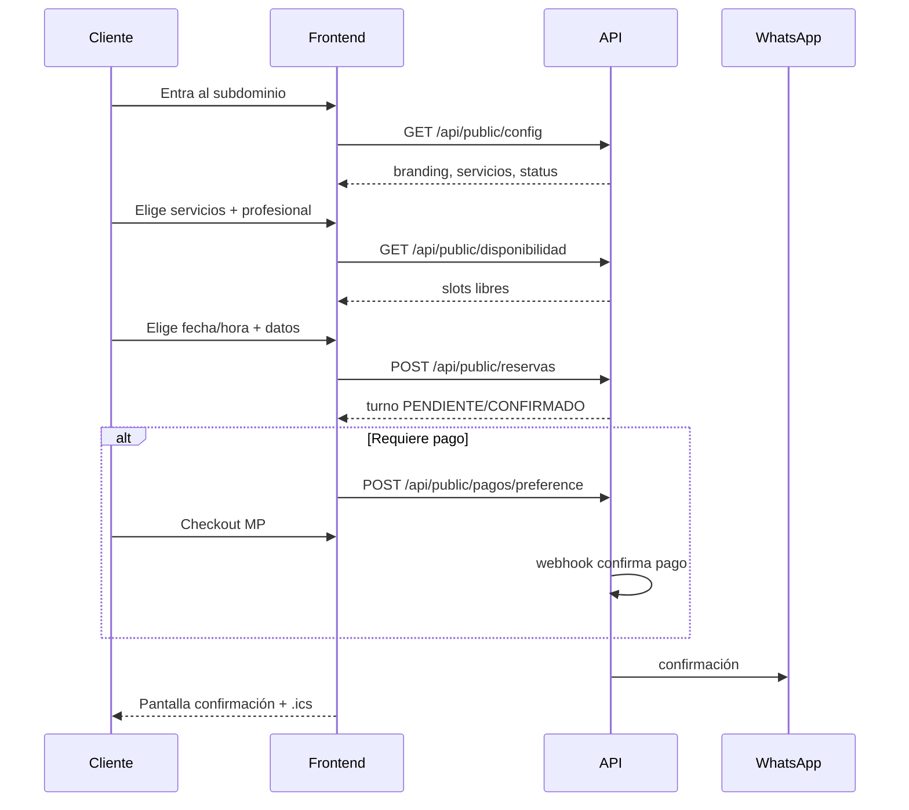
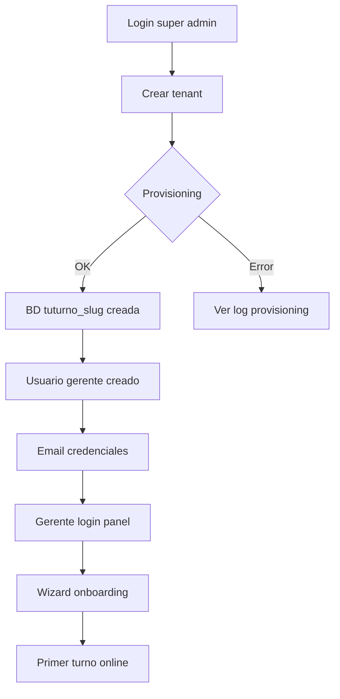

# User journeys — TuTurno

| Campo | Valor |
|-------|-------|
| Estado doc | HECHO |
| Última revisión | 2026-05-20 |
| Relacionado con | [BUSINESS-RULES.md](./BUSINESS-RULES.md), [06-frontend-cliente/SCREENS.md](../06-frontend-cliente/SCREENS.md) |
| Bloquea a | Flujos UI, API pública, tests E2E |

---

## J1 — Reserva online (cliente final)

**Actor:** Cliente final  
**Precondición:** Local ACTIVO, servicios configurados, horarios definidos  
**URL:** `https://peluqueria-naz.localhost` (dev)

**Postcondición:** Turno en BD, cliente notificado, panel recibe SSE.

**Excepciones:**
- Slot tomado entre selección y submit → error `SLOT_TAKEN`, refrescar slots
- Local PAUSADO → landing con mensaje, sin reserva
- Pago rechazado → turno PENDIENTE con link reintentar

---

## J2 — Cancelación self-service

**Actor:** Cliente final  
**Trigger:** Link en WhatsApp/email `/{token}/cancelar`

1. Cliente abre link con token firmado
2. Ve resumen del turno
3. Confirma cancelación (si dentro de política)
4. Turno → CANCELADO
5. Notificación al local (SSE + opcional WhatsApp)
6. Slot liberado para otros

**Reglas:** Ver [BUSINESS-RULES.md](./BUSINESS-RULES.md) — anticipación mínima cancelación.

---

## J3 — Reprogramación self-service

Similar a J2 con flujo de nueva disponibilidad. Token de un solo uso o ventana temporal.

---

## J4 — Turno manual (recepcionista)

**Actor:** Recepcionista o gerente  
**URL:** `panel.localhost`

1. Login (email + password; tenant resuelto por índice global)
2. Agenda → click slot vacío
3. Buscar/crear cliente
4. Elegir servicios, profesional
5. Guardar → CONFIRMADO (sin pago online)
6. Opcional: enviar WhatsApp confirmación

---

## J5 — Onboarding nuevo local (super admin)

**Actor:** Super admin  
**URL:** `admin.localhost`

**Datos mínimos al crear tenant:**
- nombre comercial
- slug (validar subdominio no reservado)
- email gerente inicial
- plan (trial por defecto)

---

## J6 — Configuración Mercado Pago (gerente)

1. Panel → Configuración → Pagos
2. Ingresar access token MP del local
3. Elegir modo: sin pago / seña % / seña fija / total
4. Guardar en `tenant_meta` o tabla config
5. Probar con reserva sandbox

---

## J7 — Recordatorio automático

**Trigger:** Cron/worker cada 15 min

1. Buscar turnos CONFIRMADOS en ventana 24h y 2h
2. Verificar no enviado previamente (`notificaciones_enviadas`)
3. Enviar WhatsApp + email fallback
4. Registrar envío

---

## J8 — Marcar no-show (recepcionista)

1. Turno pasó hora fin + grace period (ej. 15 min)
2. Recepcionista marca NO_ASISTIO desde agenda
3. Opcional: penalización futura (config)
4. Stats actualizadas

---

## J9 — Lista de espera

1. Cliente no encuentra slot deseado
2. Deja teléfono + rango preferido
3. Al cancelarse un turno compatible → worker notifica primer en lista
4. Link temporal para reservar (15 min TTL)

---

## Estado implementación

Ver [STATUS.md](../STATUS.md).
