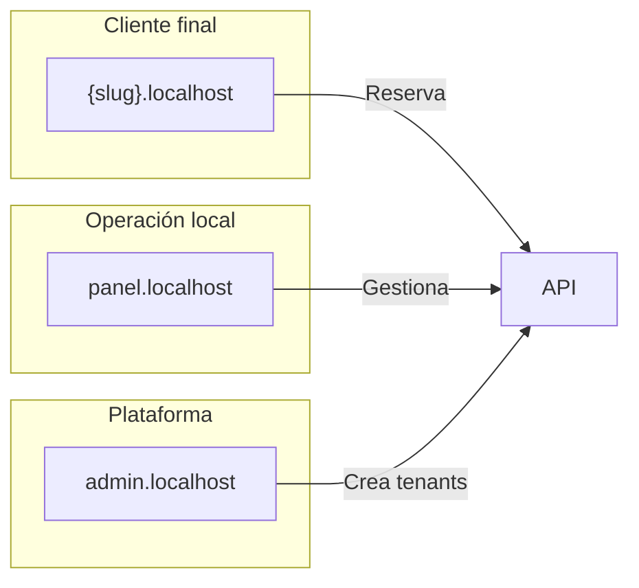

# Visión del producto — TuTurno

| Campo | Valor |
|-------|-------|
| Estado doc | HECHO |
| Última revisión | 2026-05-20 |
| Relacionado con | [USER-PERSONAS.md](./USER-PERSONAS.md), [PLANS-AND-LIMITS.md](./PLANS-AND-LIMITS.md) |
| Bloquea a | Roadmap, UI, pricing |

---

## Objetivo

TuTurno es una plataforma SaaS que permite a comercios locales argentinos ofrecer **reserva de turnos online** con:

- Página propia por subdominio (`peluqueria.localhost` / `{slug}.{BASE_DOMAIN}`)
- Panel único centralizado para administrar agenda, servicios y clientes
- Confirmaciones automáticas por WhatsApp y email
- Pagos opcionales con Mercado Pago (seña o total)
- Super panel para el dueño del software crear y gestionar locales

El objetivo de implementación documentado es un **sistema profesional 100% funcional en local**, no un MVP reducido.

---

## Problema que resuelve

| Dolor del local | Solución TuTurno |
|-----------------|------------------|
| Reservas por WhatsApp caóticas | Flujo online estructurado 24/7 |
| Doble reserva / olvidos | Motor de disponibilidad + bloqueos |
| No-shows | Seña MP + recordatorios WhatsApp |
| Sin historial de clientes | CRM lite integrado |
| Sin métricas | Estadísticas de turnos e ingresos |

---

## Propuesta de valor

> **"Tu agenda online con confirmación por WhatsApp — dejá de perder tiempo en el celular."**

Diferenciadores frente a Calendly genérico o agendas en papel:

- Pensado para Argentina: Mercado Pago, WhatsApp (Baileys), español rioplatense
- Multi-tenant SaaS con aislamiento real por local
- UI minimalista dark, profesional, mobile-first
- Onboarding rápido del local (wizard 15 minutos)

---

## Segmentos objetivo (v1)

| Segmento | Ejemplo | Particularidades |
|----------|---------|------------------|
| Barberías / peluquerías | Nazareno Hairdressing | Servicios combo, productos add-on, múltiples barberos |
| Estética / uñas | Estética Luna | Duraciones variables, profesionales especializados |
| Consultorios pequeños | Nutrición, psicología | Sin productos, seña opcional, confidencialidad |
| Veterinarias (fase 2+) | — | Mascota como dato extra |

Enfoque inicial: **barberías y estética** (schema legacy ya orientado).

---

## Componentes del sistema

1. **App cliente** — reserva sin login
2. **Panel del local** — agenda, CRUD, stats, config
3. **Super panel** — alta de tenants, planes, soporte
4. **API** — pública, tenant autenticada, super

---

## Alcance funcional completo (local)

Incluye todo lo documentado en:

- Reserva pública end-to-end con disponibilidad real
- Múltiples profesionales con agendas propias
- Pagos Mercado Pago (seña, total, pago en local)
- WhatsApp Baileys + email
- Personalización de página (logo, colores, textos)
- Estadísticas y CRM lite
- Lista de espera y reprogramación self-service
- Roles: gerente, recepcionista, profesional
- Super admin con provisioning
- Tests Jest + Playwright + checklist QA ~100 ítems

Excluido del alcance inicial (documentado en prod):

- Dominio custom por tenant (`turnos.milocal.com`)
- Facturación automática de suscripción SaaS
- App nativa iOS/Android

---

## Modelo comercial (referencia)

| Plan | Precio orientativo | Target |
|------|-------------------|--------|
| trial | Gratis 14 días | Evaluación |
| basico | $8.000–15.000 ARS/mes | 1 profesional |
| profesional | $20.000–35.000 ARS/mes | MP + stats + 5 profesionales |
| enterprise | A medida | Multi-sucursal futuro |

Detalle en [PLANS-AND-LIMITS.md](./PLANS-AND-LIMITS.md).

---

## Métricas de éxito del producto

| Métrica | Objetivo |
|---------|----------|
| Activation | Local crea primer turno online en 7 días |
| No-show rate | Reducción >30% vs baseline manual |
| Turnos online / total | >50% en locales activos |
| Time-to-first-reserva | <15 min post onboarding |

---

## Estado implementación

Ver [STATUS.md](../STATUS.md).
