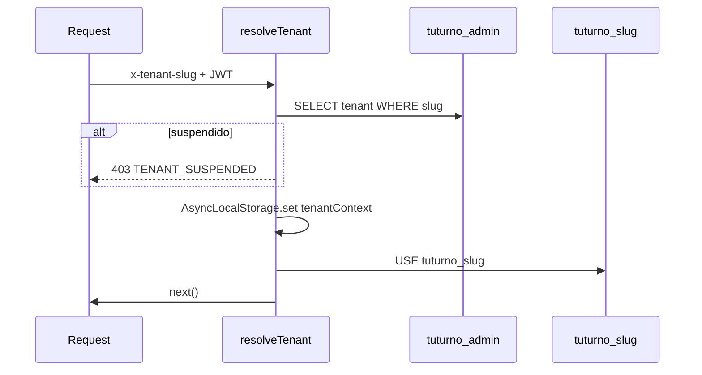

# Multi-tenancy — TuTurno

| Campo | Valor |
|-------|-------|
| Estado doc | HECHO |
| Última revisión | 2026-05-20 |
| Relacionado con | [04-datos/SCHEMA-ADMIN.md](../04-datos/SCHEMA-ADMIN.md), [05-backend/PROVISIONING.md](../05-backend/PROVISIONING.md) |
| Bloquea a | Backend middleware, DB setup |

---

## Modelo: database-per-tenant

Inspirado en **planificador** (`planificador_admin` + `planificador_{slug}`).

| Plano | BD | Contenido |
|-------|-----|-----------|
| Control plane | `tuturno_admin` | tenants, super_usuarios, tenant_user_index, provisioning_runs, audit |
| Data plane | `tuturno_{slug}` | turnos, clientes, servicios, usuarios del local, etc. |

**No** se usa BD compartida con `barberia_id` (modelo legacy turnero).

---

## Flujo request tenant



---

## AsyncLocalStorage

Patrón planificador (`runWithTenantContext`):

```typescript
interface TenantContext {
  tenantId: number;
  tenantSlug: string;
  dbName: string;
  plan: string;
  config: TenantConfigJson;
}
```

Repositories leen contexto; no reciben `barberia_id` en cada query.

---

## Usuarios

| Tipo | Ubicación |
|------|-----------|
| Super admin | `tuturno_admin.super_usuarios` |
| Usuarios panel local | `tuturno_{slug}.usuarios` |
| Índice login global | `tuturno_admin.tenant_user_index` (email → tenant_id, slug) |

Login panel sin slug en URL:

1. `POST /api/auth/login` con email + password
2. Buscar en `tenant_user_index`
3. Autenticar contra BD tenant correspondiente
4. JWT con tenant_id + tenant_slug

---

## Clientes finales

Solo en BD tenant. No hay cuenta/login cliente en v1.

---

## Provisioning

Ver [05-backend/PROVISIONING.md](../05-backend/PROVISIONING.md).

Pasos:
1. Insert `tenants` en admin
2. `CREATE DATABASE tuturno_{slug}`
3. Ejecutar `schema_tenant.sql`
4. Insert usuario gerente + tenant_user_index
5. Registrar run en `tenant_provisioning_runs`

---

## Backup / restore

Por tenant: dump individual `tuturno_{slug}`. Ver [13-produccion/BACKUP-RESTORE.md](../13-produccion/BACKUP-RESTORE.md).

---

## Estado implementación

Ver [STATUS.md](../STATUS.md).
