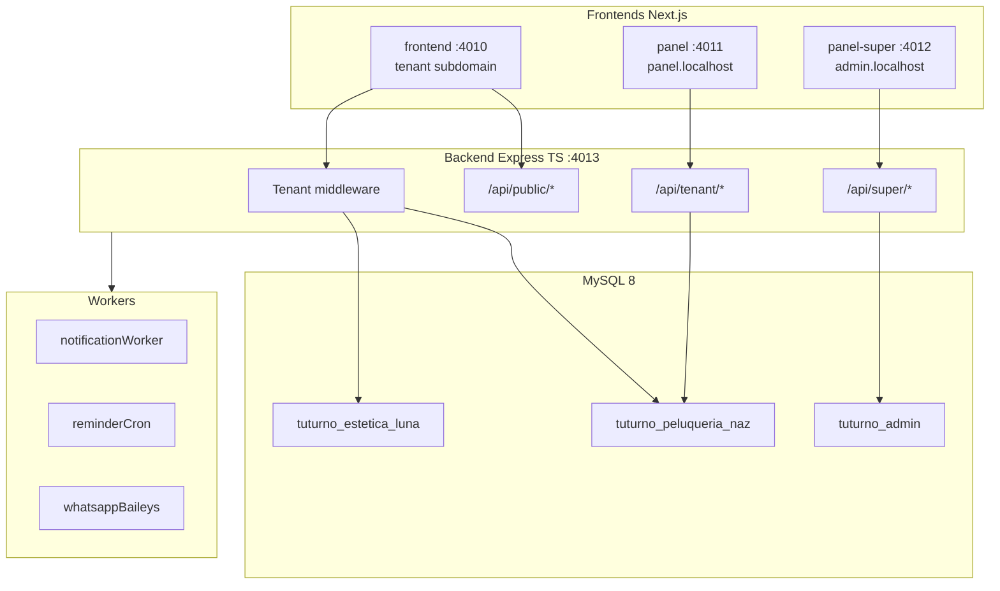

# Arquitectura — Vista general

| Campo | Valor |
|-------|-------|
| Estado doc | HECHO |
| Última revisión | 2026-05-20 |
| Relacionado con | [MULTITENANCY.md](./MULTITENANCY.md), [SUBDOMAINS-AND-ROUTING.md](./SUBDOMAINS-AND-ROUTING.md) |
| Bloquea a | Todo el monorepo |

---

## Resumen

TuTurno es un monorepo con **1 backend API** y **3 aplicaciones Next.js**, respaldadas por **MySQL database-per-tenant** y un **control plane** central.

---

## Capas

| Capa | Responsabilidad |
|------|-----------------|
| Presentación | 3 apps Next.js con design system compartido |
| API | Express TypeScript, Zod, JWT, tenant context |
| Dominio | Services: turnos, disponibilidad, pagos, notificaciones |
| Datos | Repositories SQL, pool MySQL con `USE db` por request |
| Infra local | PM2, /etc/hosts, MySQL local |

---

## Principios arquitectónicos

1. **Aislamiento fuerte:** una BD por tenant; nunca mezclar datos en queries sin contexto
2. **API pública separada:** reservas sin JWT; rate limit por IP + tenant
3. **Subdominio = tenant:** el slug se deriva del Host en frontends; header `x-tenant-slug` en API
4. **Secrets separados:** SUPER_JWT ≠ JWT tenant
5. **Idempotencia:** pagos y webhooks
6. **Eventos:** SSE panel; cola interna para WhatsApp

---

## Puertos desarrollo

| Servicio | Puerto |
|----------|--------|
| frontend | 4010 |
| panel | 4011 |
| panel-super | 4012 |
| backend | 4013 |

---

## Referencias de proyectos hermanos

| Patrón | Origen |
|--------|--------|
| Database-per-tenant | planificador |
| SSE pedidos → reservas | carrito |
| page_status, geocoding | carrito |
| Provisioning + runs | planificador |
| MP webhooks | turnero legacy + carrito |

---

## Estado implementación

Ver [STATUS.md](../STATUS.md).
