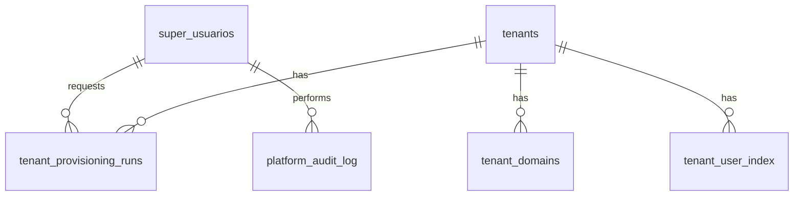
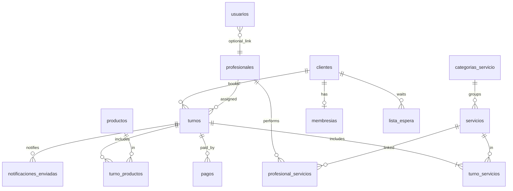

# Diagrama ER — TuTurno

| Campo | Valor |
|-------|-------|
| Estado doc | HECHO |
| Última revisión | 2026-05-20 |
| Relacionado con | [SCHEMA-ADMIN.md](./SCHEMA-ADMIN.md), [SCHEMA-TENANT.md](./SCHEMA-TENANT.md) |
| Bloquea a | Implementación repositories |

---

## Control plane (tuturno_admin)

---

## Data plane (tuturno_slug)

---

## Relaciones clave

| Relación | Cardinalidad | Regla |
|----------|--------------|-------|
| turno → cliente | N:1 | Obligatorio |
| turno → profesional | N:1 | Opcional si "cualquiera" |
| turno → servicios | N:M | Al menos 1 servicio |
| profesional → servicios | N:M | Define quién puede hacer qué |

---

## Estado implementación

Ver [STATUS.md](../STATUS.md).
