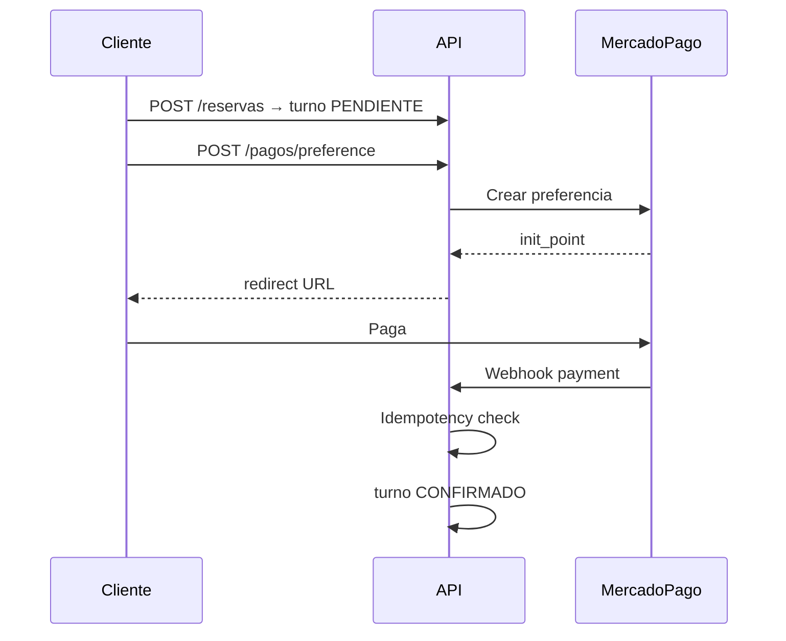

# Pagos Mercado Pago — TuTurno

| Campo | Valor |
|-------|-------|
| Estado doc | HECHO |
| Última revisión | 2026-05-20 |
| Relacionado con | [TURNO-LIFECYCLE.md](./TURNO-LIFECYCLE.md) |
| Bloquea a | mercadoPagoService |

---

## Config por tenant

`politicas_reserva.mp_access_token` — token del local (no platform).

Modos: ver [BUSINESS-RULES.md](../01-producto/BUSINESS-RULES.md) BR-030.

---

## Flujo



---

## Preferencia

```json
{
  "items": [{ "title": "Seña turno #123", "quantity": 1, "unit_price": 2400 }],
  "external_reference": "tuturno:peluqueria-naz:turno:123",
  "notification_url": "https://api.localhost:4013/api/webhooks/mercadopago",
  "back_urls": {
    "success": "http://peluqueria-naz.localhost:4010/pago/exito?turno=123",
    "failure": "http://peluqueria-naz.localhost:4010/pago/error?turno=123",
    "pending": "http://peluqueria-naz.localhost:4010/pago/pendiente?turno=123"
  },
  "auto_return": "approved"
}
```

---

## Webhook

1. Parse `external_reference` → tenant_slug + turno_id
2. Verificar firma/x-signature MP
3. Idempotency: `pagos.idempotency_key = payment.id`
4. Si approved → CONFIRMADO + insert pago
5. Si rejected → mantener PENDIENTE, notificar cliente

---

## Monto seña

```typescript
if (modo === 'SEÑA_PORCENTAJE') monto = total * (seña_porcentaje / 100);
if (modo === 'SEÑA_FIJA') monto = seña_monto_fijo;
```

---

## Sandbox local

Usar credenciales test MP en `.env` tenant demo.

---

## Estado implementación

Ver [STATUS.md](../STATUS.md).
