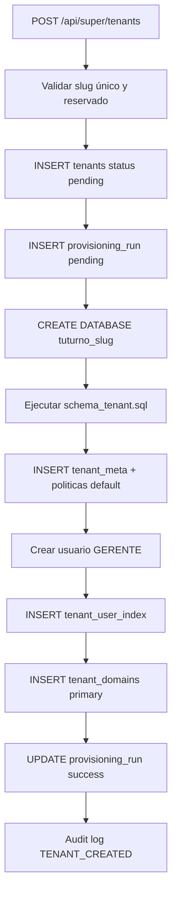

# Provisioning de tenants — TuTurno

| Campo | Valor |
|-------|-------|
| Estado doc | HECHO |
| Última revisión | 2026-05-20 |
| Relacionado con | [04-datos/SCHEMA-ADMIN.md](../04-datos/SCHEMA-ADMIN.md) |
| Bloquea a | tenantProvisioningService |

---

## Flujo



---

## Errores

Cualquier fallo → provisioning_run status=error, error_message, tenant status permanece activo pero flag `provisioning_incomplete` en config_json o verificar db_name NULL.

Super admin puede POST reprovision.

---

## API

```typescript
async function provisionTenant(input: CreateTenantInput, requestedBy: number): Promise<Tenant>
```

---

## Idempotencia

Si BD ya existe → error claro; no sobrescribir.

---

## Seed opcional

Flag `seedDemoData: true` en create tenant → insert servicios/horarios demo.

---

## Estado implementación

Ver [STATUS.md](../STATUS.md).
