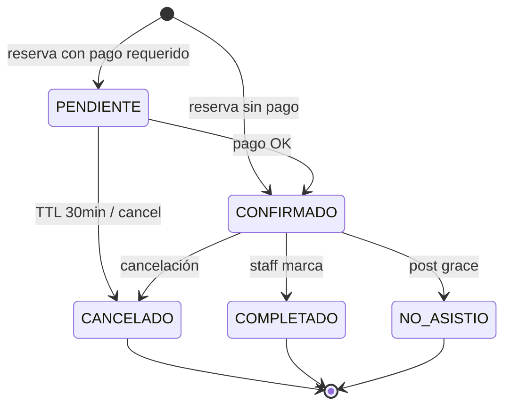

# Ciclo de vida del turno — TuTurno

| Campo | Valor |
|-------|-------|
| Estado doc | HECHO |
| Última revisión | 2026-05-20 |
| Relacionado con | [PAYMENTS-MERCADOPAGO.md](./PAYMENTS-MERCADOPAGO.md), [NOTIFICATIONS-WHATSAPP.md](./NOTIFICATIONS-WHATSAPP.md) |
| Bloquea a | turnoService |

---

## Diagrama estados

---

## Side effects por transición

| Transición | Acciones |
|------------|----------|
| → PENDIENTE | Crear cliente si nuevo, snapshot precios, token_gestion, reservar slot lógico |
| PENDIENTE → CONFIRMADO | MP webhook o manual; WhatsApp confirmación; SSE turno.created |
| → CANCELADO | Liberar slot; WhatsApp cancelación; SSE; restaurar stock si aplica |
| CONFIRMADO → COMPLETADO | Membresía puntos; stats |
| CONFIRMADO → NO_ASISTIO | Stats no-show |

---

## token_gestion

UUID v4 + HMAC opcional en URL. Permite GET/POST gestionar sin auth.

---

## Jobs

| Job | Frecuencia | Acción |
|-----|------------|--------|
| expirePendingTurnos | 5 min | PENDIENTE sin pago > 30min → CANCELADO |
| sendReminders24h | 15 min | WhatsApp/email recordatorio |
| sendReminders2h | 15 min | Idem |
| processWaitlist | On cancel | Notificar lista espera |

---

## Estado implementación

Ver [STATUS.md](../STATUS.md).
