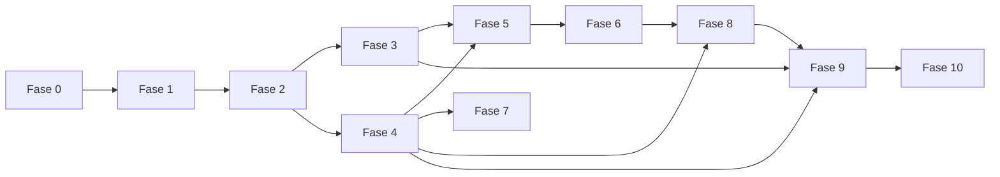

# Roadmap — TuTurno

| Campo | Valor |
|-------|-------|
| Estado doc | HECHO |
| Última revisión | 2026-05-20 |
| Relacionado con | [BACKLOG.md](./BACKLOG.md), [DEFINITION-OF-DONE.md](./DEFINITION-OF-DONE.md) |
| Bloquea a | Orden de desarrollo |

---

## Fases

| Fase | Nombre | Tareas | Depende de |
|------|--------|--------|------------|
| 0 | Scaffold | T-001–T-020 | — |
| 1 | Control plane + provisioning | T-021–T-038 | 0 |
| 2 | API pública + availability | T-039–T-060 | 1 |
| 3 | Frontend cliente | T-061–T-085 | 2 |
| 4 | Panel operativo | T-086–T-115 | 2 |
| 5 | Pagos Mercado Pago | T-116–T-127 | 3, 4 |
| 6 | Notificaciones | T-128–T-142 | 5 |
| 7 | Personalización + stats + CRM | T-143–T-157 | 4 |
| 8 | Roles + avanzado | T-158–T-172 | 4, 6 |
| 9 | Testing | T-173–T-180 | 1-8 |
| 10 | Pulido + QA local | T-181–T-190 | 9 |

---

## Diagrama dependencias

---

## Hitos verificables

| Hito | Fase | Verificación |
|------|------|--------------|
| H1 | 1 | Crear tenant desde super panel |
| H2 | 2 | curl disponibilidad devuelve slots reales |
| H3 | 3 | Reserva completa en peluqueria-naz.localhost |
| H4 | 4 | Agenda muestra turno + SSE |
| H5 | 5 | Pago sandbox MP confirma turno |
| H6 | 6 | WhatsApp confirmación recibida |
| H7 | 10 | QA checklist 100% verde |

---

## Documentos por fase

- [PHASE-0-SCAFFOLD.md](./PHASE-0-SCAFFOLD.md)
- [PHASE-1-DATA-PROVISIONING.md](./PHASE-1-DATA-PROVISIONING.md)
- [PHASE-2-PUBLIC-API.md](./PHASE-2-PUBLIC-API.md)
- [PHASE-3-FRONTEND-CLIENTE.md](./PHASE-3-FRONTEND-CLIENTE.md)
- [PHASE-4-PANEL.md](./PHASE-4-PANEL.md)
- [PHASE-5-PAGOS.md](./PHASE-5-PAGOS.md)
- [PHASE-6-NOTIFICACIONES.md](./PHASE-6-NOTIFICACIONES.md)
- [PHASE-7-PERSONALIZACION-STATS.md](./PHASE-7-PERSONALIZACION-STATS.md)
- [PHASE-8-ROLES-AVANZADO.md](./PHASE-8-ROLES-AVANZADO.md)
- [PHASE-9-TESTING.md](./PHASE-9-TESTING.md)
- [PHASE-10-PULIDO.md](./PHASE-10-PULIDO.md)

---

## Estado implementación

Ver [STATUS.md](../STATUS.md).
